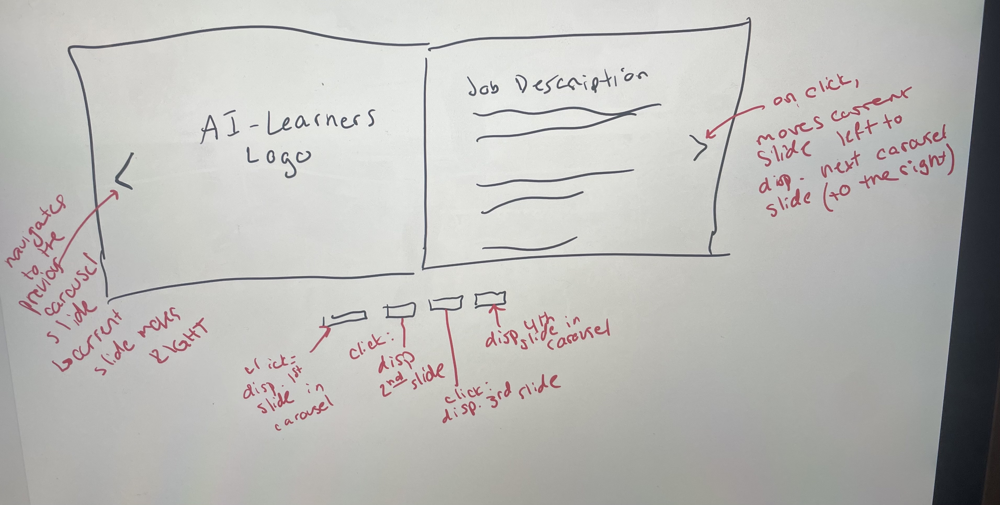
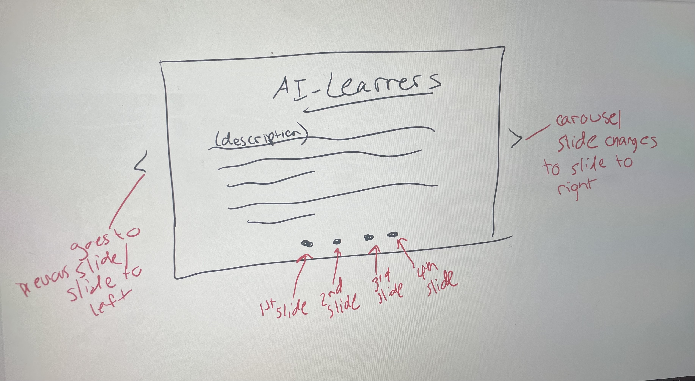
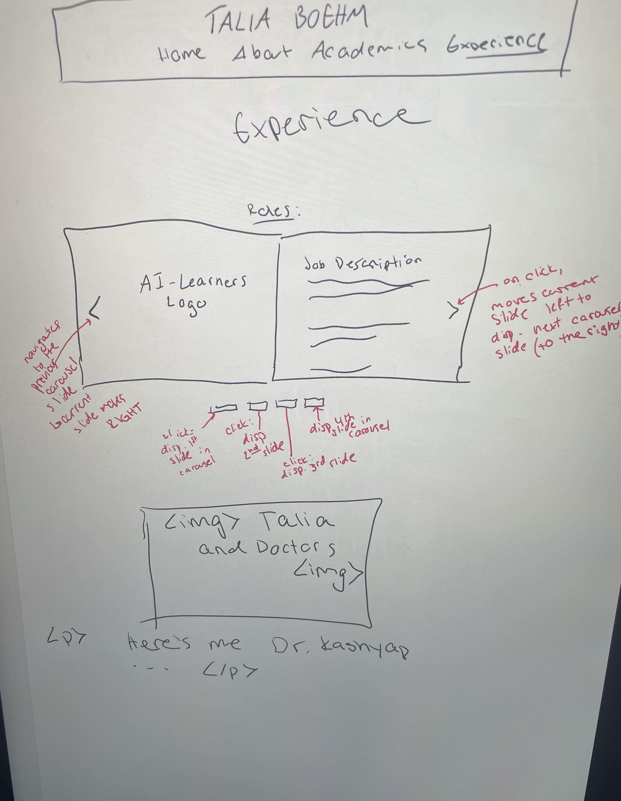
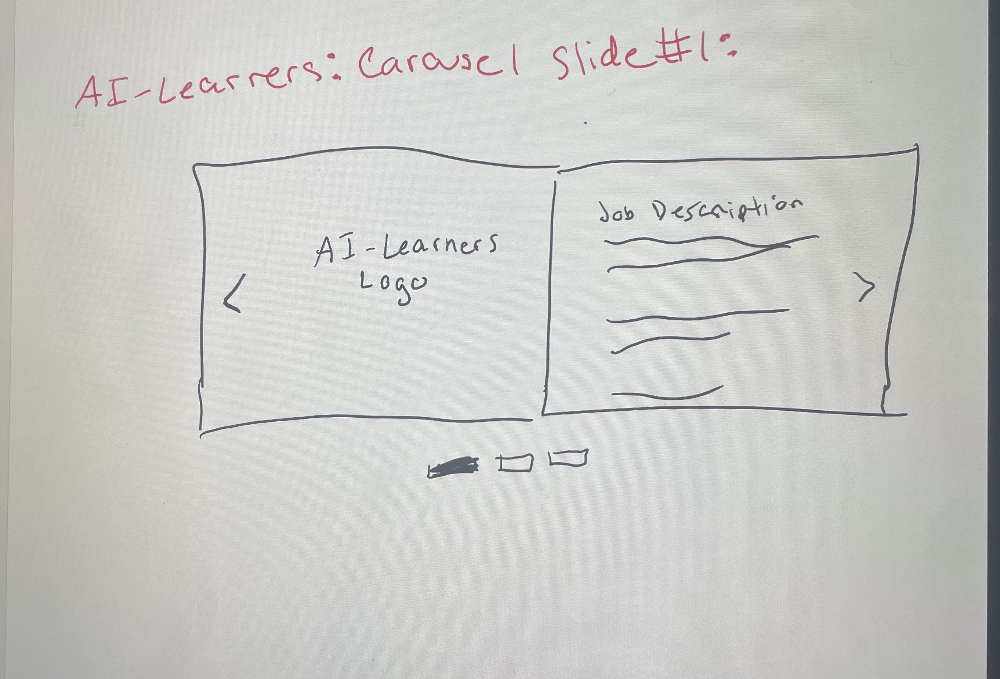
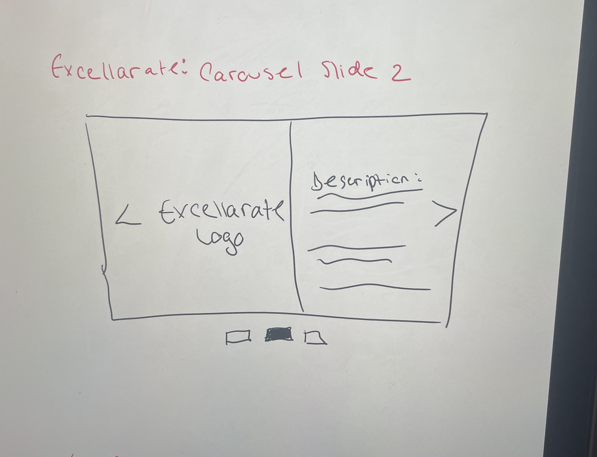
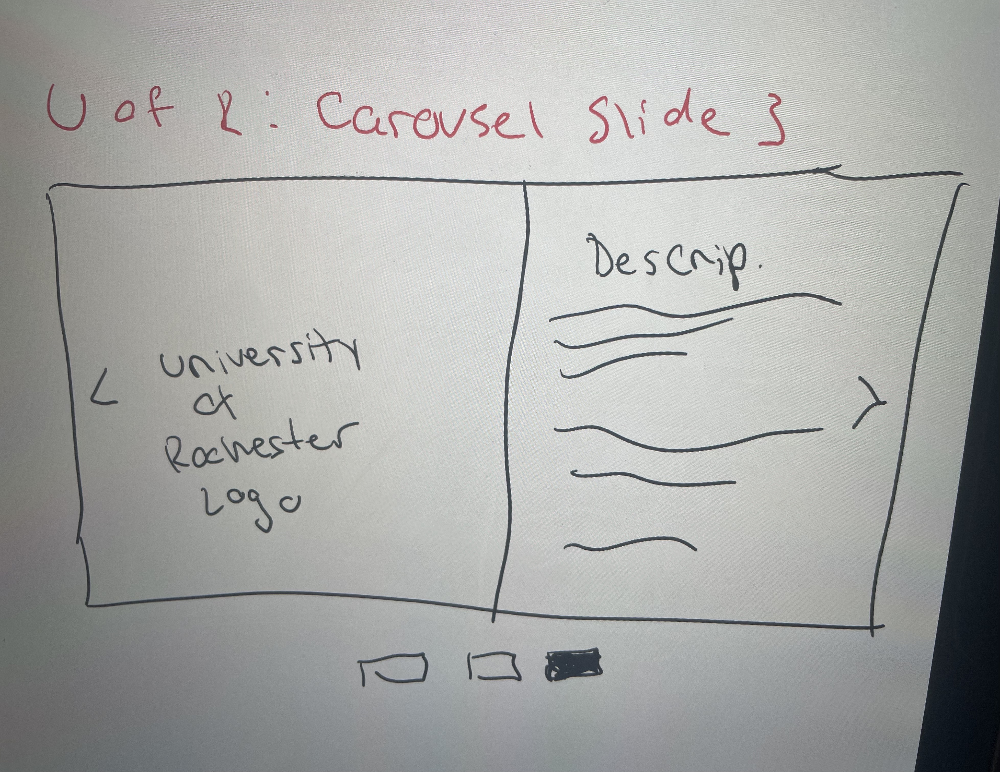

# Project 3: Design Journey

**For each milestone, complete only the sections that are labeled with that milestone.**

**Replace ALL _TODOs_ with your work.** (There should be no TODOs in the final submission.)

Be clear and concise in your writing. Bullets points are encouraged.

**Everything, including images, must be visible in Markdown Preview.** If it's not visible in Markdown Preview, then we won't grade it. We won't give you partial credit either. This is your warning.

# Existing Project

**Tell us about the project you'll be using for Project 3.**

## Project (Milestone 1)
> Which project will you add interactivity to enhance the site's functionality?

Project 1

## Audience (Milestone 1)
> Who is your project site's audience?
> This should be the original audience from Project 1 or Project 2.
> You should adjust the audience if necessary. Just make sure you explain your rationale for doing so here.

The audience of this site will be the employers/organizations that are deciding if they should recruit/hire me. The website is appropriate for my potential employers is because it contains all of the relevant information about my work experience, education, skills, and interests that would normally be considered when applying for a position. This website will also be good for employers to view because it will reveal my  more than typical application materials would.

## Audience's Goals (Milestone 1)
> List the audience's goals that you identified in Project 1 or 2.
> Just list each goal. No need to include the "Design Ideas and Choices", etc. You may adjust the goals if necessary. However, any changes you make to the goals for this project should be clearly identified and justified.

- See if I have the experience/qualifications they are looking for
- Understand more about me as a professional
- Learn about my strengths/skills
- Easily find relevant information about me

# Interactivity Design

## Interactivity Brainstorm (Milestone 1)
> Using the audience goals you identified, brainstorm possible options for interactivity to enhance the functionality of the site while also assisting the audience with their goals.
> Briefly explain idea each idea and provide a brief rationale for how the interactivity enhances the site's functionality for the audience.
> Note: You may find it easier to sketch for brainstorming. That's fine too. Do whatever you need to do to explore your ideas.

- Use slideshow of images instead of having multiple images displayed near one another
  - makes pages less cluttered and allows users to see as many pictures as they want
- Create a banner with my resume to encourage users to view resume
- Make button/buttons for things that I want people to click on
- make nav bar interactive --> make the nav bar elements change to underlined when users are hovering over them
- create carousel for multiple pieces of content that are laid out the same way

## Interactivity Proposal & Rationale (Milestone 1)
> Make a decision about your site's interactivity. Explain what you plan to implement and where it will go on your site.
> Describe the purpose of your proposed interactivity. Provide a brief rationale explaining how your proposed interactivity addresses the goals of your site's audience.

**Interactivity Proposal:**

- I am going to make a carousel on the experience page that has each of my work experiences on a separate slide. This page currently has each individual work experience in a box and all of the boxes are stacked in a column. This design is repetitive and crowds the page. I want to maintain the content I already have for each experience but also clean up the page so it is not overcrowded. If I turn the 3 work experiences I have listed into a carousel with one experience/ slide, this will reduce the amount of overcrowded and repetative content that is always visible on the page. Also, this will allow users to view each of my experiences on their own slide. This will allow users to see my experiences one role at a time by navigating between slides,

**User Goals Rational:** TODO

Right now, all of my work experiences are contained in a big column where each row has one work experience and a description of the experience. By making my experiences into a carousel, the user will easily be able to differentiate and navigate between my experiences. The carousel will take up much less space in order to simplify the page and make it so the user doesn't need to scroll as extensively. This meets the audience goals of both easily finding relevant information about me and seeing what experience I have.

Also, recruiters don't want to waste time when they are looking at a personal website, so this carousel gives them the autonomy to view as much or as little of my work experience as they feel is necessary. This also allows them to choose WHICH of my work experiences to read about/ focus on by navigating to the slide for that role.

## Interactivity Design Ideation (Milestone 1)
> Now that you've made a decision about the site's interactivity, explore the possible design solutions for the interactivity.
> Sketch several iterations of your interactivity.
> Annotate each sketch explaining what happens when a user takes an action. (e.g. When user clicks this, this happens.)

_Interactivity Sketch 1:_  

_Interactivity Sketch 2:_  

## Final Interactivity Design (Milestone 1)
> Review your sketches from the previous step and pick your final design.
> Create a _polished_ sketch (it's still a sketch, but with a little more care taken to communicate ideas clearly to the graders) to plan your interactivity.
> **Sketch out the entire page where your interactivity will go.** Add your interactivity to the sketch. Add any annotations to explain what happens when the user takes an action.
> Include as many sketches as necessary to communicate your design (ask yourself, could another 1300 take these sketches an implement my design?)

_Carousel Final Sketch:_  

_Carousel Slide 1:_  

_Carousel Slide 2:_  

_Carousel Slide 3:_  

## "Ambitious" Interactivity Explanation
> In your own words, concisely explain why you believe your interactivity meets the "ambitious" requirement.

My interactivity is a carousel so it meets the ambitious requirement since the instructions of this project list carousel as an example of ambitious interactivity.

## Additional Information (Milestone 1)
> (optional) Include any additional information, justifications, or comments we should be aware of.

N/A

# Interactivity Implementation Plan (Final Submission)

## HTML Interactivity Plan (Final Submission)
> Plan the HTML elements you will use in your interactivity.
> For each element, give its `id=` (if it has one) and any default styling (`class=`)

- right-button: `<button type="button" class = "right-arrow"> 	&gt;</button>`
- left -button: `<button type="button" id = "left-arrow">	&lt;</button>`
- left button: `
`
- slide 1: `
`
- slide 2: `
`
- slide 3: `
`
- button1 default: `<button type="button" class = "dotDefault" id = "dot1"> &#9675;</button>`
- button1
<button type="button" class="currentDot" id="dot1Clicked"> 	&#9898;</button>

## CSS Interactivity Plan (Final Submission)
> Plan the CSS classes you will need for your interactivity

-  `.button` - style all buttons for carousel with same
- `.button:hover` - change button color to white and increase size
- `.dot: current slide` -
- `.rightArrow:click` - go to next slide when right arrow is clicked (make next slide visible and all other slides hidden)
- `.leftArrow:click` - go to prev. slide when right arrow is clicked (make prev. slide visible and all other slides hidden)
- `.dot: click` - make the slide that corresponds with
make dot visible
- `.dot: click`- make the dot that corresponds with current slide filled in and white and larger to show slide selected

## Interactivity Pseudocode (JavaScript) Plan (Final Submission)
> Write your interactivity pseudocode plan here.

when page loads:
  add .hidden to all elements in class .slide
  remove .hidden from #slide1
  add .hidden to emphasized dots (.currentDot)
  add .hidden to #dot1
  remove .hidden from #dot1Clicked

<!-- Write Carousel Functions -->
  copy carousel snippet for methods-
  previousSlide()
    when this function is called, get previous slide and call showSlide()
  nextSlide()
    when this function is called, get next slide and call showSlide()
  showSlide()
    methods for calling showSlide()-
      add class .hidden to all elements in .slide
      remove .hidden from currentSlide
      remove .hidden from the selected version of the #dotClicked
      add .hidden to the default #dotClicked

when right arrow is clicked:
  go to the next slide by calling nextSlide() func.

when left arrow is Clicked
  go to the previous slide by calling previousSlide  

when a dot is clicked:
  navigate to correct slide by calling showSlide(slide index)
    -(this method navigates to the corrrect slide and updates the dot to the dot that corresponds to the new slide)

when a button is hovered over:
  add class .hover to the button while user is hovering
  remove class .hover from the button when user is not hovering anymore

# Grading (Final Submission)

## Interactivity Usability Justification (Final Submission)
> Explain how your design effectively uses affordances, visibility, feedback, and familiarity.

Affordances:
- when a user hovers over a button, (something clickable), the button changes from transparent to solid white and gets larger to a
  - Reasoning: Helps user see that buttons are clickable so they know they can click
- The right and left arrows point to which way they move the carousel slides (left vs. right)
- The dots indicate the number of slides and allow the users to see the order of the slides

Visibility:
- The left and right arrows are visible and become emphasized when they are hovered over
- the navigation dots are visible and also become emphasized when a user is hovering

Feedback:

- When a certain slide is selected to be shown, the navigation dot for that slide is updated so it is emphasized (filled in)
- When a user clicks the right arrow, the next slide is displayed and appropriate dot is updated/ selected
- when a user clicks the left arrow, the previous slide is displayed and the selected dot is updated/ selected
- when a user clicks a certain dot, the slide corresponding to that dot is displayed and the dot clicked on (the dot for that slide) becomes "selected"

Familiarity:
- In general, this is a standard carousel design and users are familiar with the arrows allowing them to navigate to the  previous slide or the next slide. Users are also familiar with the dots at the bottom that indicate the number of slides, the order of slides, and allow users to click on a dot to get a new slide to display.
- Users are also familiar with buttons that are transparent in the default state and that change to an opaque color when the being hovered over/ clicked

## Additional Design Justifications (Final Submission)
> If you feel like you haven’t fully explained your design choices in the final submission, or you want to explain some functions in your site (e.g., if you feel like you make a special design choice which might not meet the final requirement), you can use the additional design justifications to justify your design choices. Remember, this is place for you to justify your design choices which you haven’t covered in the design journey. Use it wisely. However, you don’t need to fill out this section if you think all design choices have been well explained in the final submission design journey.

N/A -> My design is a very standard carousel

## Tell us What to Grade (Final Submission)
> We aren't re-grading your Project 1 or 2. We are only grading the interactivity you added.
> Tell us where (what page) we can find your interactivity and how to use it.
> **We will only grade what you list here;** if it's not listed, we won't grade it.

My interactivity is a carousel that is displayed on the page "experience.html". You can open this file in the browser, or click on the link "experience" in the nav bar from anywhere on my site.

The carousel is at the very top of the experience page and the users can click the left and right arrows to navigate to the previous or next slide. Users can also see which slide they are on in the slide order based on which dot is filled in below the slides. Users can navigate to a certain slide in the order by clicking on a dot that is not the dot for the current displayed slide.

Code:

The HTML is coded in-
 - "experience.html" starting on line 39

 All CSS that I added for Interactivity is in the styles folder-
 - file: "site.css" lines 366 to 494

 The JS file is in the scripts folder-
 - file: "carousel.js" and this entire document is relevant for my interactivity

 Design:

 ALL content in design folder is relevant to this assignment
 - see "design-journey.md"
 - all jpg files are included in THIS md file

## Additional Resources/References (Final Submission)
> If you referenced other websites (or sources, including tutorials) on this project, list them here.

The only code that I referenced was the instructor provided resource "Interactivity Snippets Reference"

- To get the code for the symbols I used for my buttons I googled HTML special characters and used the codes provided on the site:

https://dev.w3.org/html5/html-author/charref

## Self-Reflection (Final Submission)
> This was the first project in this class where you coded some JavaScript. What did you learn from this experience?

I am pretty familiar with coding already and I found that the Javascript syntax is very similar to Java syntax. I learned that it is also a lot easier to debug code in JS than in other programming languages because we are coding interactivity so we can actually see if the code we are writing to producing the correct results on the screen.

I also learned how JavaScript files interact with jQuery and layer with CSS, and HTML to create an interactive interface.

> Reflect on how HTML, CSS, and JavaScript together support client-side interactivity. If it's helpful, you can describe your mental model of client-side interactivity or explain how the general idea of showing and hiding content can be used to implement other forms of client-side interactivity beyond what you've done in this project.

HTML is used to add the content that will be used as a part of the interactivity. CSS is used to style content and present (or not present) content involved in  interactivity (i.e. class hidden to display vs. not display elements). HTML and CSS alone create a styled, static website. In order to make the website interactive so that the web page appearance/ content changes somehow, we have to use JavaScript. JavaScript allows us to change a web page based on a user action. These events can be anything from the page loading to a user hovering over a button and "changing the page appearance" can be anything from changing the color of an element when a user hovers over the element to choosing the amount of text content that a user can see when they click a drop down box. Interactivity is used to enhance the websites functionality to help users accomplish their goals. To do this, it is not only necessary to connect HTML and CSS to style a site's content: it's also essential to allow connect a users actions to change the way they are viewing a page.

> Take some time here to reflect on how much you've learned since you started this class. It's often easy to ignore our own progress. Take a moment and think about your accomplishments in this class. Hopefully you'll recognize that you've accomplished a lot and that you should be very proud of those accomplishments!

I have genuinely learned and understood so much in this course. Not only have I gained the technical skills to code in HTML, CSS, and JavaScript, I've also learned about design and user experience's role in Software Engineering. This is the first class where I have been able to immediately apply what I am learning to create something tangible and physical (versus learning a lot of theoretical information that I can't use unless I get a PhD). Now I am leaving this class with both the knowledge of web design and programming and 3 websites that I coded from scratch.

I didn't know how to code coming into Cornell last year (or what coding even was) nor did I understand the incredible breadth of web/ software development (especially the inherently human side of development) until I took this course. This is the first class where I have realized how much I can help people/ make a change by connecting people to technology. I am a lot more certain about being an Info Sci major now, and this is first CS class at Cornell (and I have taken a lot of CS here) that has given me the confidence and inspiration to consider pursuing software development.
